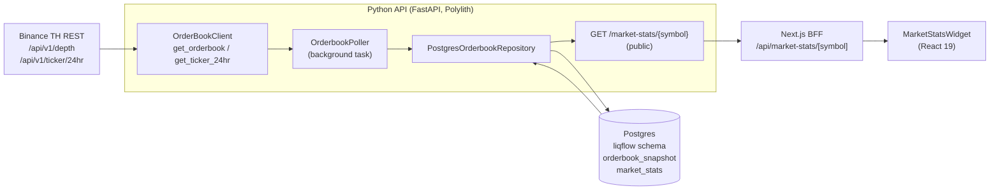
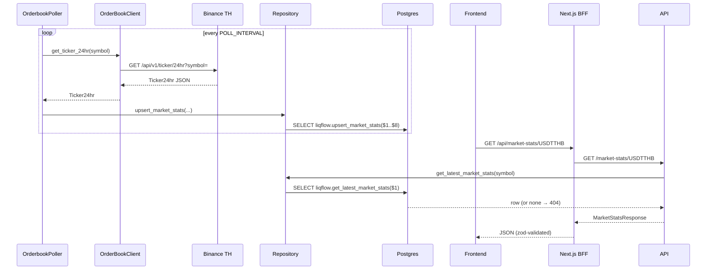
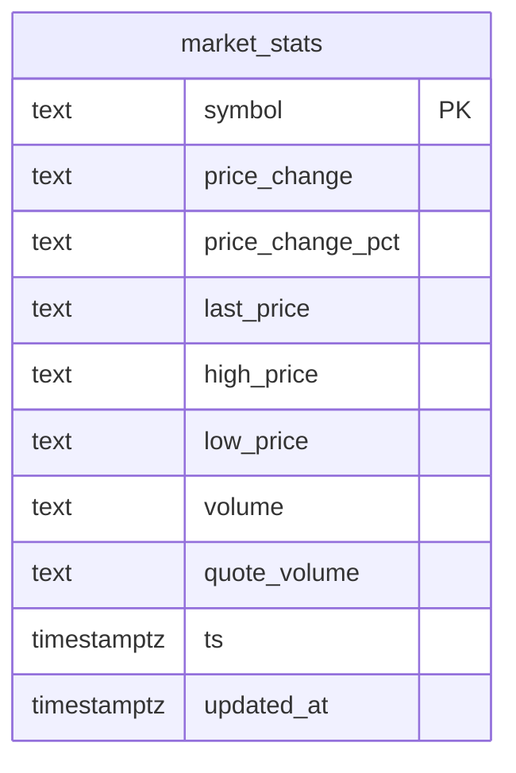
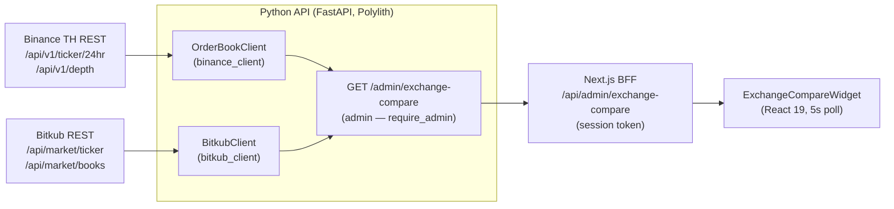
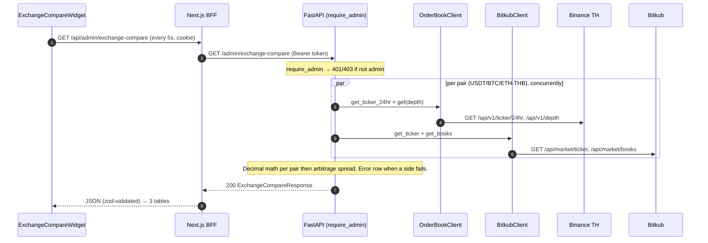

# Backend task — design & UML

Scope of this change: added the **Binance TH `GET /api/v1/ticker/24hr`** feed end
to end — new client method, poller wiring, `market_stats` table via migration
`000004`, a public API endpoint, BFF proxy, and a frontend widget.

## 1. Component / data-flow

New pieces are `get_ticker_24hr`, the poller's ticker branch, `market_stats`
(table + `upsert_market_stats` / `get_latest_market_stats` stored functions),
`/market-stats/{symbol}`, the BFF route, and the widget.

## 2. Poll → serve sequence

Ticker polling is wrapped in try/except: a ticker failure logs a warning and
never breaks the order-book poll loop.

## 3. `market_stats` entity

One row per symbol (latest snapshot only — `ON CONFLICT (symbol) DO UPDATE`),
mirroring how the baseline keeps only the latest order-book snapshot. Numeric
fields are stored as `TEXT` to preserve Binance's exact string precision (no
float rounding); consumers parse to `Decimal` when doing math (see
`scripts/play_ticker.py`).

---

# Admin feature — cross-exchange comparison (Binance TH vs Bitkub)

A second change set: an **admin-only** live comparison. Unlike the market-stats
feature it does **not** persist — the endpoint fetches both exchanges live per
request and computes the metrics in-process. New pieces: the `bitkub_client`
component, `GET /admin/exchange-compare`, a BFF proxy, and `ExchangeCompareWidget`
under a tabbed admin page.

## 4. Component / data-flow

No database is involved: the endpoint gathers both exchanges concurrently and
returns computed metrics. Each exchange fetch is isolated so one side failing
yields an `error` row, not a 500.

## 5. Request → compare sequence

## 6. Response shape

`ExchangeCompareResponse { generated_at, pairs[] }` where each `pair` is
`{ symbol, binance: ExchangeQuote, bitkub: ExchangeQuote, arbitrage_spread_pct }`
and `ExchangeQuote` is `{ exchange, last_price, price_change_pct, quote_volume,
best_bid, best_ask, spread_pct, error? }`. All numeric fields are fixed-point
strings (Decimal-computed) or `null`. Bitkub best bid/ask come from the ticker's
`highestBid`/`lowestAsk` (authoritative; the `/books` outer rows can be stale),
with the book rate as fallback.
